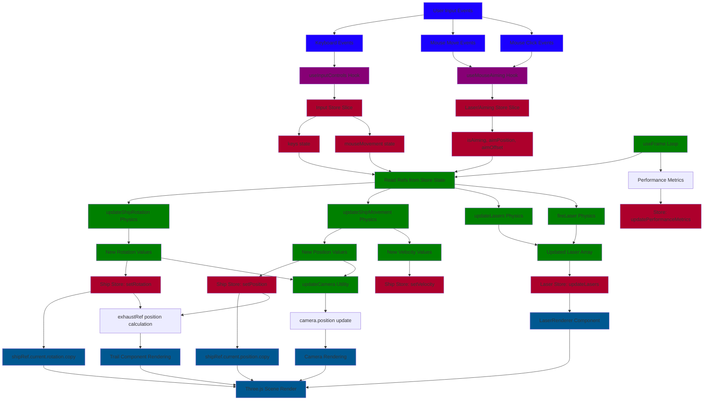
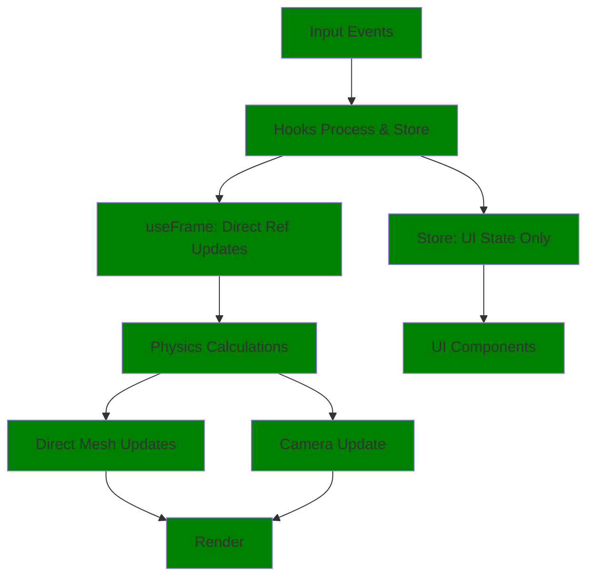

# flow Chart

```mermaid
graph TD
    %% Input Events
    A[User Input Events] --> A1[Keyboard Events]
    A[User Input Events] --> A2[Mouse Move Events]
    A[User Input Events] --> A3[Mouse Click Events]

    %% Input Processing
    A1 --> B1[useInputControls Hook]
    A2 --> B2[useMouseAiming Hook]
    A3 --> B2

    %% Store Updates
    B1 --> C1[Input Store Slice]
    B2 --> C2[Laser/Aiming Store Slice]

    C1 --> C3[keys state]
    C1 --> C4[mouseMovement state]
    C2 --> C5[isAiming, aimPosition, aimOffset]

    %% Physics Calculations (useFrame)
    D[useFrame Loop] --> D1[Read Refs from Store State]
    C3 --> D1
    C4 --> D1
    C5 --> D1

    D1 --> E1[updateShipRotation Physics]
    D1 --> E2[updateShipMovement Physics]
    D1 --> E3[updateLasers Physics]
    D1 --> E4[fireLaser Physics]

    %% Physics Results
    E1 --> F1[New Rotation Values]
    E2 --> F2[New Position Values]
    E2 --> F3[New Velocity Values]
    E3 --> F4[Updated Laser Array]
    E4 --> F4

    %% Store State Updates
    F1 --> G1[Ship Store: setRotation]
    F2 --> G2[Ship Store: setPosition]
    F3 --> G3[Ship Store: setVelocity]
    F4 --> G4[Laser Store: updateLasers]

    %% Rendering Updates
    G1 --> H1[shipRef.current.rotation.copy]
    G2 --> H2[shipRef.current.position.copy]
    G4 --> H3[LaserRenderer Component]

    %% Camera Updates
    F2 --> I1[updateCamera Utility]
    F1 --> I1
    I1 --> I2[camera.position update]
    I2 --> H4[Camera Rendering]

    %% Engine Trail
    G1 --> J1[exhaustRef position calculation]
    G2 --> J1
    J1 --> H5[Trail Component Rendering]

    %% Final Rendering
    H1 --> K[Three.js Scene Render]
    H2 --> K
    H3 --> K
    H4 --> K
    H5 --> K

    %% Performance Tracking
    D --> L1[Performance Metrics]
    L1 --> L2[Store: updatePerformanceMetrics]

    %% Styling
    classDef input fill:#1b00ff
    classDef hook fill:#870075
    classDef store fill:#ad002c
    classDef physics fill:#008000
    classDef render fill:#005891

    class A,A1,A2,A3 input
    class B1,B2 hook
    class C1,C2,C3,C4,C5,G1,G2,G3,G4,L2 store
    class D,D1,E1,E2,E3,E4,F1,F2,F3,F4,I1 physics
    class H1,H2,H3,H4,H5,K render
```

## target flow

```mermaid
graph TD
    %% Simplified Input to Render Flow
    A[Input Events] --> B[Hooks Process & Store]
    B --> C[useFrame: Direct Ref Updates]
    C --> D[Physics Calculations]
    D --> E[Direct Mesh Updates]
    E --> F[Render]

    %% Store only for UI/State sharing
    B --> G[Store: UI State Only]
    G --> H[UI Components]

    %% Camera follows position directly
    D --> I[Camera Update]
    I --> F

    classDef efficient fill:#008000
    classDef removed fill:#ad002c

    class A,B,C,D,E,F,I efficient
    class G,H efficient
```
